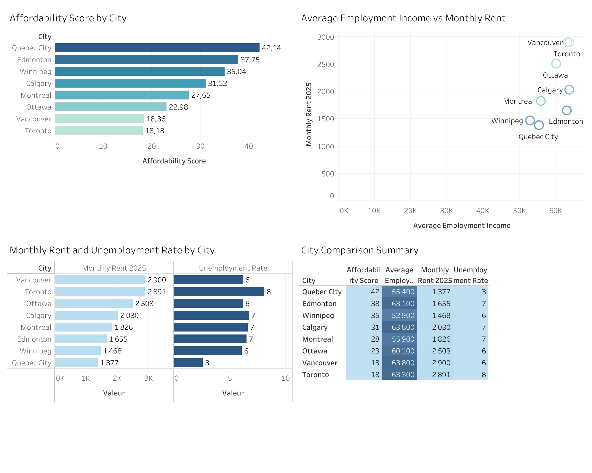

# Canadian City Affordability Analysis

## Project Overview

This project analyzes the affordability of major Canadian cities for young graduates by combining economic indicators related to income, housing costs, cost of living, and employment conditions.

The goal is to compare cities from both an affordability and employment perspective and identify how economic conditions vary across major Canadian urban areas.

The analysis covers eight cities:

- Calgary
- Edmonton
- Montreal
- Ottawa
- Quebec City
- Toronto
- Vancouver
- Winnipeg

---

## Research Questions

This project explores two main questions:

1. Which Canadian cities offer the strongest balance between affordability and employment conditions?
2. Are higher-cost cities necessarily associated with stronger economic opportunities for young graduates?

---

## Tools Used

- **SQL (BigQuery)** — data cleaning, transformation, integration, and analysis
- **Tableau** — data visualization and dashboard development
- **CSV / Excel** — initial data preparation

---

## Dataset

The final analytical dataset was created by combining multiple datasets containing:

- Average employment income
- Monthly rent
- Cost of living index
- Unemployment rate

The datasets were cleaned and standardized in BigQuery before being combined into a single city-level dataset.

The analysis includes eight Canadian cities for which comparable information was available across the selected indicators.

---

## Data Preparation & Cleaning

The SQL data preparation process included:

- Standardizing city names across datasets
- Converting numerical values into consistent formats
- Removing unnecessary fields
- Filtering datasets to retain cities with comparable information
- Combining the cleaned datasets into a single analytical table
- Creating affordability indicators for city comparison

This process ensured that the different economic indicators could be compared consistently across cities.

---

## Analysis

The final dataset was used to compare cities based on four main dimensions:

- **Income** — average employment income
- **Housing** — monthly rent
- **Cost of living** — broader living-cost index
- **Employment conditions** — unemployment rate

Two additional indicators were created to support the comparison:

- **Salary-to-Rent Ratio** — compares employment income with monthly rent
- **Affordability Score** — combines selected affordability indicators into a comparative city-level measure

---

## Key Findings

The analysis highlighted substantial differences in affordability across the eight cities.

- **Quebec City** recorded the strongest affordability score in the dataset, supported by relatively low rent and unemployment.
- **Edmonton and Winnipeg** also performed strongly in the affordability comparison.
- **Calgary** combined relatively high employment income with moderate affordability.
- **Montreal** remained more affordable than Ottawa, Toronto, and Vancouver despite lower average employment income.
- **Ottawa** recorded relatively strong employment income but higher housing costs reduced its affordability position.
- **Toronto and Vancouver** had the lowest affordability scores among the cities analyzed, largely reflecting their high housing and living costs.

The results suggest that higher employment income alone does not necessarily translate into stronger affordability.

---

## Dashboard

The interactive Tableau dashboard allows users to compare affordability and employment indicators across the eight cities.

### Dashboard Preview

 

**View the interactive dashboard on Tableau Public:**  
https://public.tableau.com/views/FinalCityComparison/Tableaudebord1?:language=fr-CA&:sid=&:redirect=auth&:display_count=n&:origin=viz_share_link

---

## Limitations

This analysis should be interpreted as a comparative portfolio project rather than a complete measure of individual affordability.

Key limitations include:

- The indicators come from different datasets and reporting periods.
- Average city-level values do not capture differences between individuals or households.
- Taxes, transportation costs, household size, debt, and other personal expenses are not included.
- Employment income data may lag behind more recent rent and unemployment information.
- The affordability score is a comparative analytical measure created for this project and should not be interpreted as an official affordability index.

---

## Skills Demonstrated

SQL • BigQuery • Data Cleaning • Data Transformation • Data Integration • Exploratory Data Analysis • Economic Analysis • Data Visualization • Tableau • Data Storytelling

---

## Feedback Welcome

This project is part of my data analytics portfolio and ongoing learning journey.

Constructive feedback is welcome, particularly on the SQL methodology, affordability analysis, indicator selection, dashboard design, and interpretation of the results.

If you identify an area that could be improved or have a different approach to comparing Canadian city affordability, feel free to open an issue or start a discussion.
